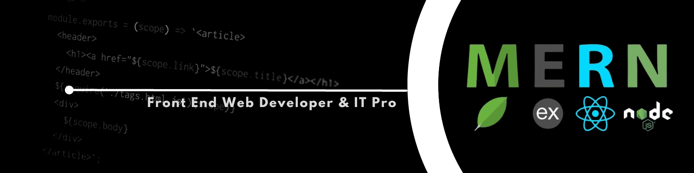

<h1 align="center">Hi 👋, I'm Abdulwase Naeemi</h1>
<h3 align="center">A passionate IT Professional and Web Developer from Afghanistan</h3>

  

- 🌱 I’m currently learning **JavaScript**

- 👨‍💻 All of my projects are available at [https://abdulwase-naeemi.netlify.app/index.html](https://abdulwase-naeemi.netlify.app/index.html)

- 💬 Ask me about **HTML, CSS, Bootstrap, Sass**

- 📫 How to reach me **abdulwasenaeemi7@gmail.com**

- 📄 Know about my experiences [https://drive.google.com/drive/folders/1CEsl2xT3jzwskJ9ELOq6CUlIAK08fATB?usp=sharing](https://drive.google.com/drive/folders/1CEsl2xT3jzwskJ9ELOq6CUlIAK08fATB?usp=sharing)

- ⚡ Fun fact **I am good at time management**

<h3 align="left">Connect with me:</h3>

<h3 align="left">Languages and Tools:</h3>

         

&nbsp;

