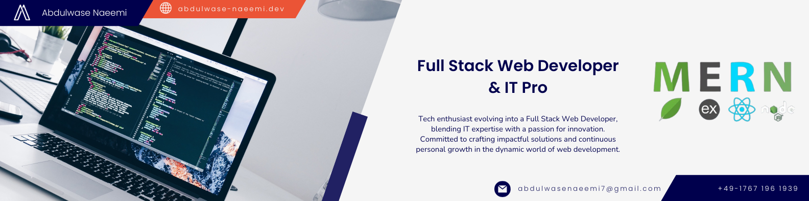

<h1 align="center">Hi 👋, I'm Abdulwase Naeemi</h1>
<h3 align="center">A passionate Web Developer and IT Professional based in Lingen (EMS), Germany</h3>

  

- 🔭 I’m currently working on [CookBook](https://github.com/Naeemi7/CookBook)

- 🌱 I’m currently learning [socket.io](https://socket.io/)

- 👨‍💻 All of my projects are available at [abdulwase-naeemi.dev](https://abdulwase-naeemi.dev)

- 📫 How to reach me **abdulwasenaeemi7@gmail.com**

 

# 💻 Technologies:

# 🛠️ Tools

### Active Projects

#### [CookBook](https://github.com/Naeemi7/CookBook)

- **01.2023 - Present**
- Project type: Personal project
- Full-stack web application designed to simplify the cooking experience for users. Allows users to discover, save, and share their favorite recipes. Features include recipe creation, ingredient tracking, and step-by-step cooking instructions.
- Technologies: React.js, Express.js, MongoDB, Node.js, JWT, bcrypt, CSS3, HTML5.
- [GitHub Repository](https://github.com/Naeemi7/CookBook)

### Past Projects

#### [Yoga and Meditation](https://github.com/Naeemi7/CookBook)

- **07.2023 - 09.2023**
- Project type: Group project at DCI
- Single-page application for yoga and meditation, providing comprehensive information and services.
- Technologies: React.js, Firebase, Vite, HTML, CSS3, SCSS, Bootstrap, Tailwindcss, Email.js.
- [Website](https://yoga-and-meditation.netlify.app) | [GitHub Repository](https://github.com/Naeemi7/yoga-and-meditation)

#### [TodoXpress](https://github.com/naeemi7/TodoXpress)

- **09.2023 - 10.2023**
- Project type: Personal project
- MERN full-stack task management app with capabilities for task addition, editing, deletion, and completion.
- Technologies: React.js, MongoDB, Express.js, Node.js, Vite, HTML, CSS3.
- [Website](https://todoxpress.onrender.com) | [GitHub Repository](https://github.com/Naeemi7/TodoXpress)

#### [gatha- get togetha](https://github.com/Naeemi7/gatha)

- **11.2023 - 12.2023**
- Project type: Group final project at DCI
- MERN full-stack group chat application with bidirectional communication using socket.io.
- Technologies: React.js, socket.io, Express.js, MongoDB, Node.js, JWT, bcrypt, CSS3, HTML5.
- Role: Backend & socket.io Lead
- [Website](https://todoxpress.onrender.com) | [GitHub Repository](https://github.com/Naeemi7/gatha)

# 📊 GitHub Summary:

 

  

  
  

  
  

 

